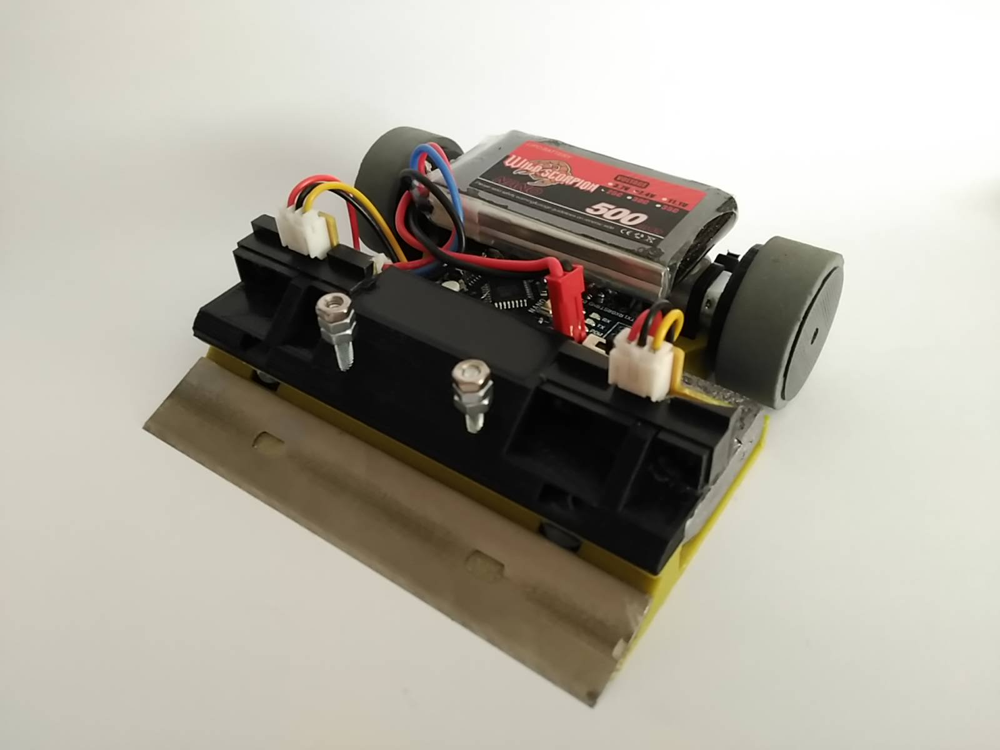
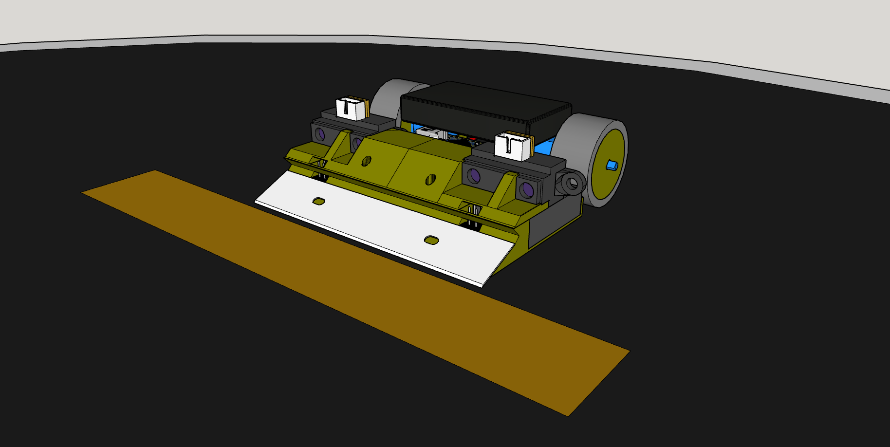

# YokozunaBot

El primer robot de minisumo creado por OPRobots. Con mucho plomo y un palito de helado.

## Hardware
- Arduino Nano
- Driver de motores TB6612FNG
- 2x Motores "Pololu" N20 @500rpm
- 2x sensores Sharp GP2Y0A41SK0F (4-30cm)
- DIP Switch 4p
- LiPo 2S 500 mAh
- 4x Sensores CNY70
- 4x Resistencias 47kΩ
- 4x Resistencias 220Ω
- Goma de ruedas reciclada de rodillos de impresora
- Chasis completamente impreso en PLA
- Peso añadido en plomo fundido a medida

## Software
- Programado con Arduino IDE
- Estategias básicas de arrancado de frente, de lado y de espaldas
- Control de línea blanca para evitar salirse del dohyo